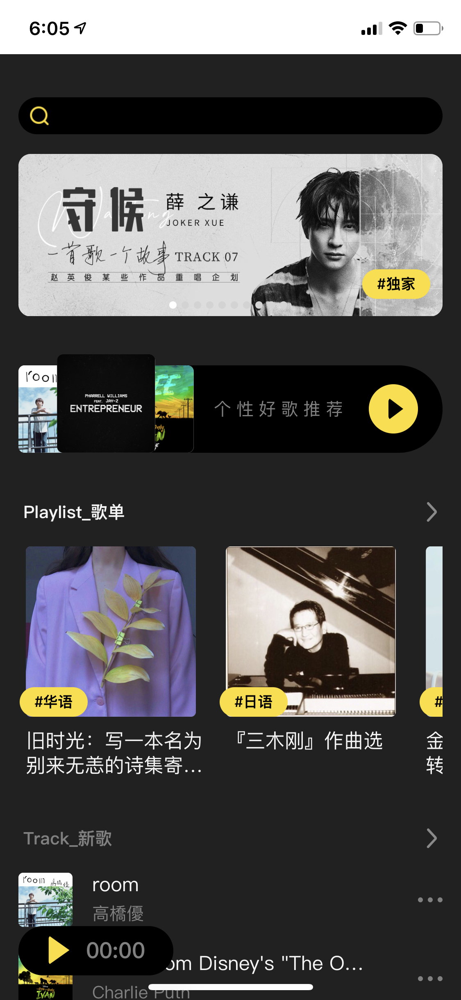
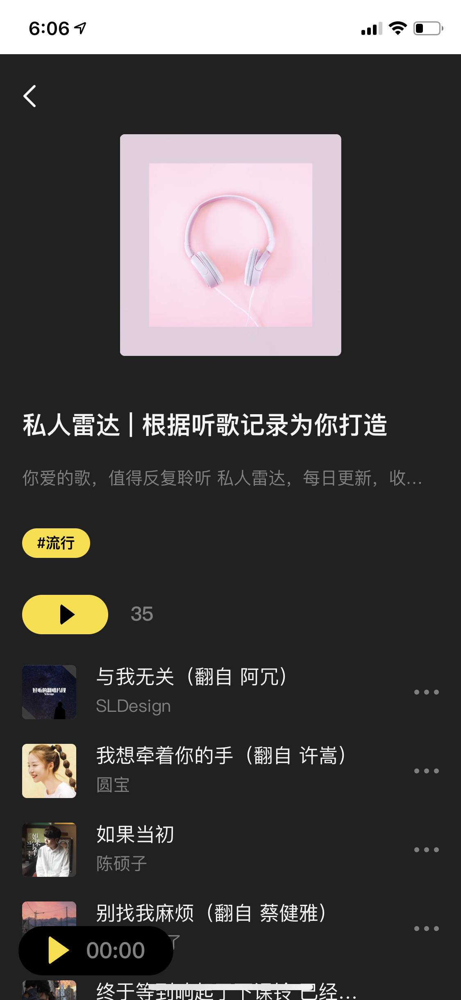
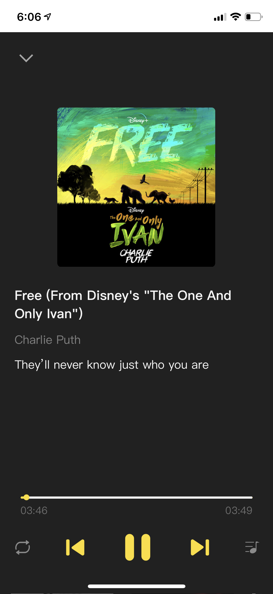
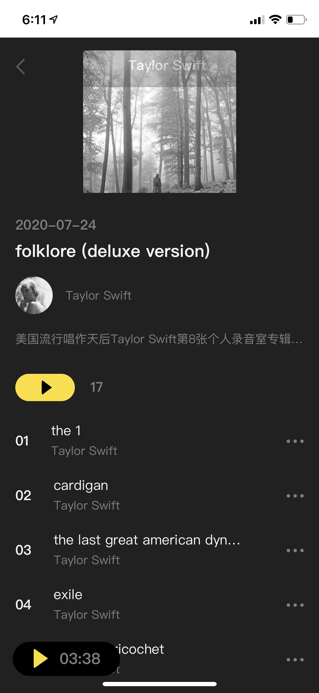
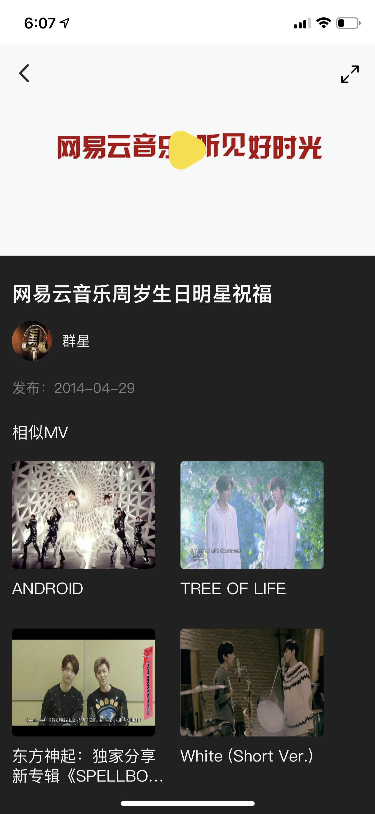
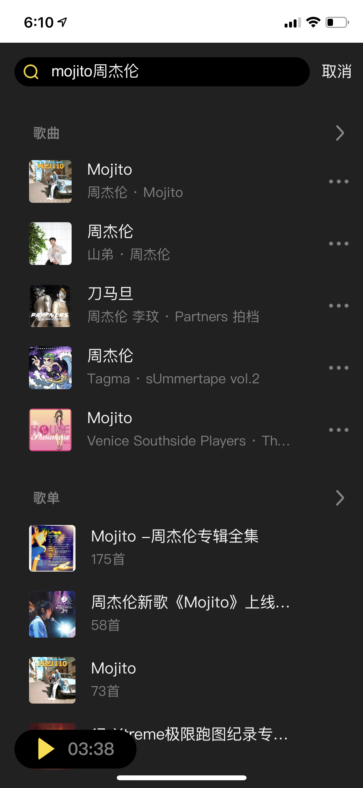
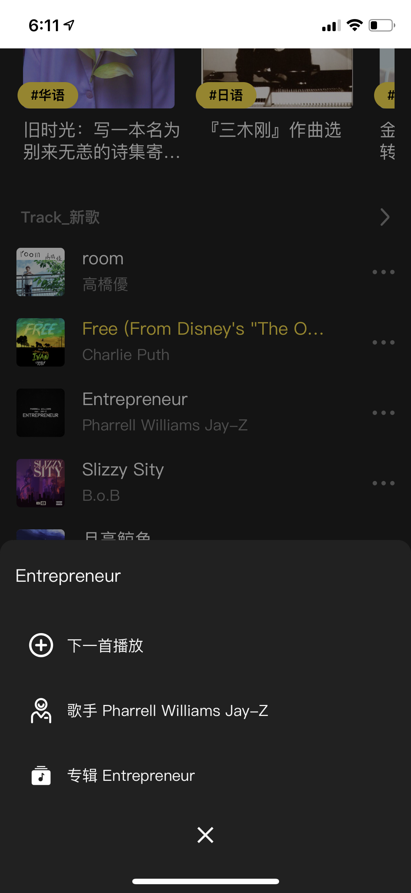

## [项目网址](url:https://111.229.9.30/)

## 项目技术特点：
1. PWA支持
2. 自行实现的React-SSR框架
3. module/nomudule 模式
4. HTTP2
5. 全站图片懒加载
6. 安卓端支持锁屏音乐控制

## 网站截图

  
  
  
  
  
  
  
  

## 技术特点介绍
### React-SSR框架
### module/nomudule 模式
### 全站图片懒加载
### PWA

## 浏览器兼容
IOS >=9，
Andriod >=6

## 本地开发

### node版本
node version >= 13.8

### 本地开发开启SSR模式
**nodemon shoudle be installed globaly**
1. npm run build:server
2. npm run build:client:modern
3. nodemon --inspect ./server_app/bundle.js

### 本地开发开启CSR模式
npm run start:client

## music-motion api 服务器参考 Binaryify 的 [NeteaseCloudMusicApi](url:https://github.com/Binaryify/NeteaseCloudMusicApi)

